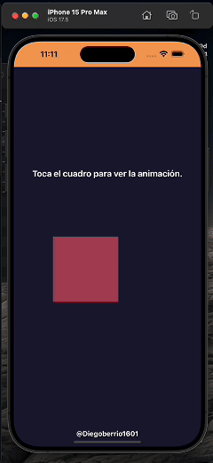

# React Native Animated Example

Este repositorio muestra un ejemplo práctico del uso de la API `Animated` de React Native para crear animaciones dinámicas y fluidas. La animación incluye:

- Transición de colores de fondo.
- Rotación continua de 360 grados.
- Movimiento en los ejes X e Y con interpolaciones suaves.



## Características

- **Transiciones suaves:** Interpolaciones configuradas para rotaciones y desplazamientos.
- **Reinicio automático:** La animación se reinicia automáticamente al completar el ciclo.
- **Configuración personalizable:** Puedes ajustar la duración, los rangos de entrada/salida y los estilos según tus necesidades.

## Tecnologías utilizadas

- **React Native**
- **Animated API**
- **Expo**

## Instalación

1. Clona este repositorio:

 ```bash
   # Usando HTTPS
   git clone https://github.com/Diegoberrio1601/basicInterpolation.git

   # Usando SSH
   git clone git@github.com:Diegoberrio1601/basicInterpolation.git

